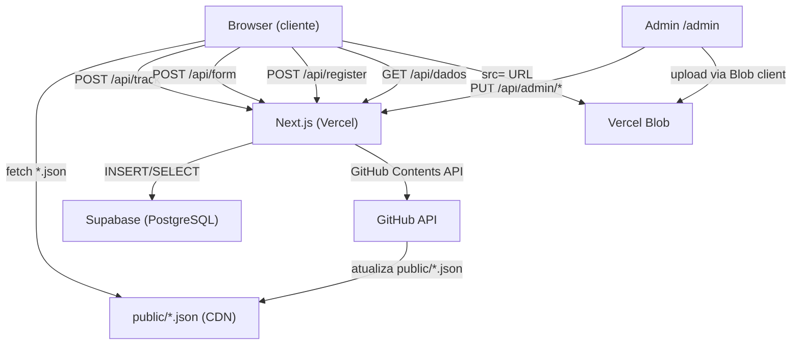
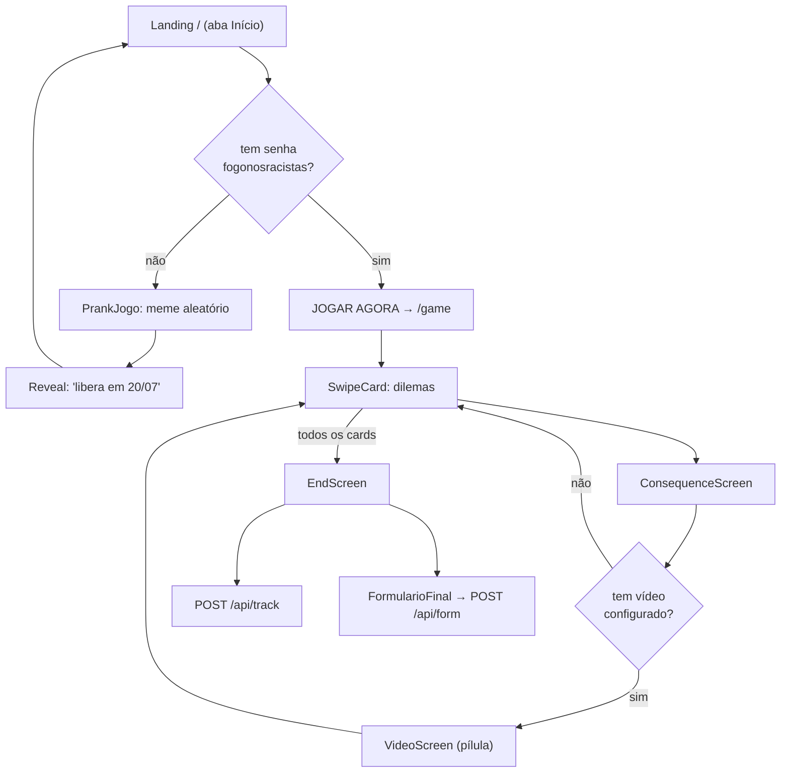
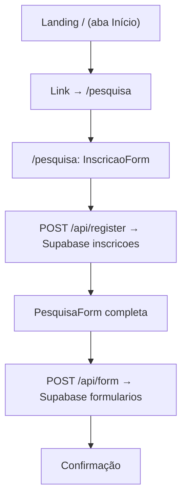
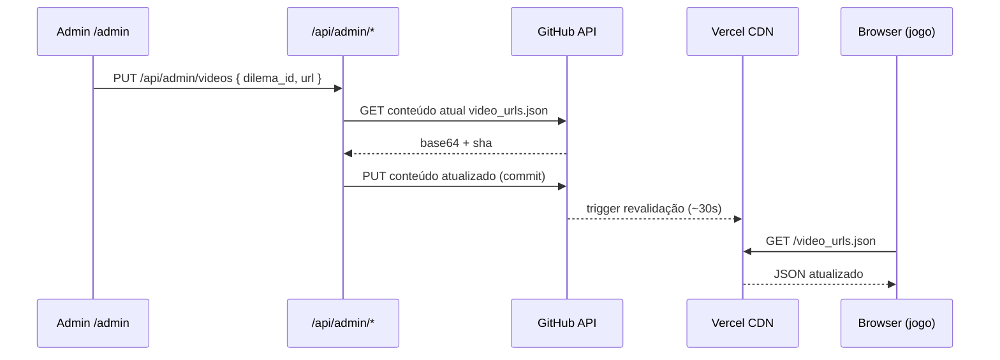
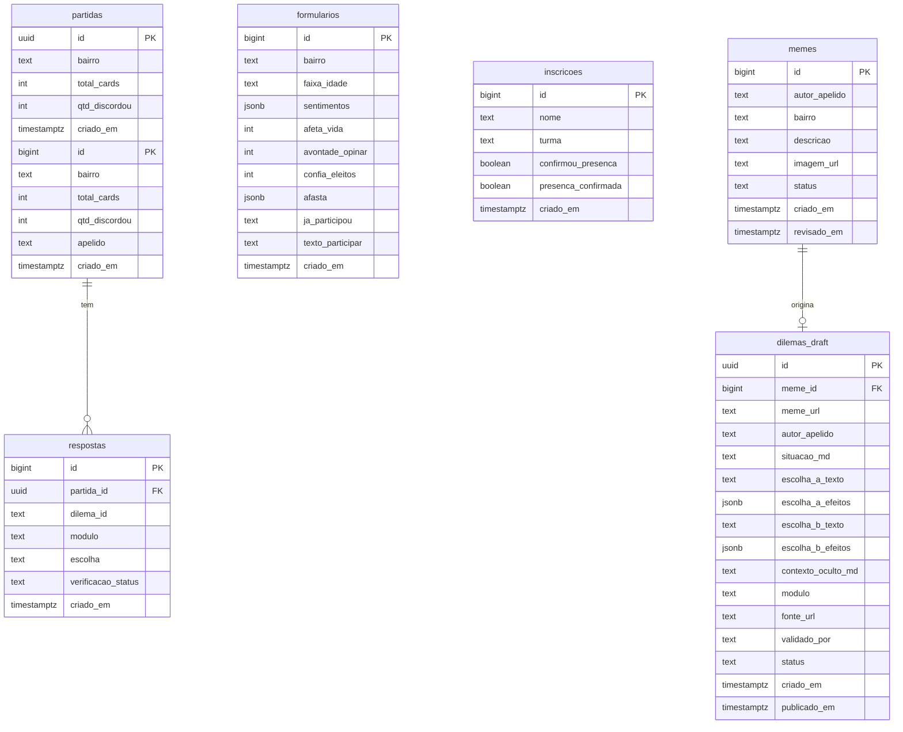
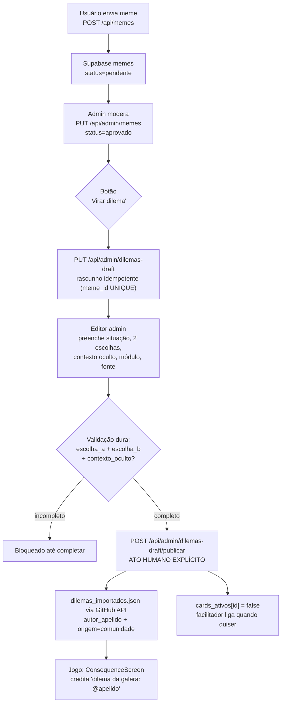
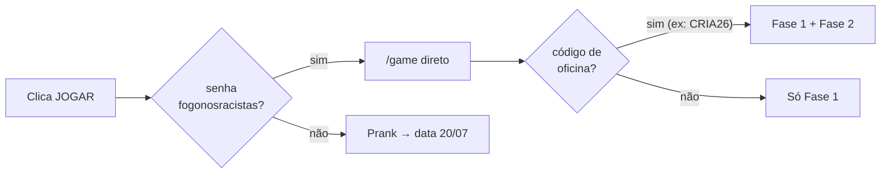

# Arquitetura — Vozes do Oziel

## Stack

| Camada | Tecnologia | Papel |
|--------|-----------|-------|
| Frontend | Next.js 16 App Router + React | Rendering, roteamento, UI |
| Estilo | Tailwind CSS + fontes customizadas | Design system zine/grafite |
| Animações | Framer Motion | Transições de card e tela |
| Backend | Next.js API Routes (Fluid Compute) | Toda lógica server-side |
| Banco de dados | Supabase (PostgreSQL) | Dados de jogo, pesquisa, inscrições, memes |
| Armazenamento | Vercel Blob | Vídeos (pílulas), áudios (trilha), imagens (memes) |
| Config runtime | GitHub API → `public/*.json` | CMS sem rebuild |
| Deploy | Vercel | CDN, Fluid Compute, preview deployments |

---

## Fluxo de dados geral



---

## Fluxo do usuário — landing → jogo



---

## Fluxo de inscrição e pesquisa



---

## Camada de configuração runtime (sem rebuild)

O CMS admin não faz deploy — ele atualiza JSONs no repositório via GitHub Contents API. A Vercel serve esses arquivos como estáticos do CDN.



**Arquivos gerenciados:**

| Arquivo | Conteúdo | Rota admin |
|---------|----------|-----------|
| `public/video_urls.json` | `{ [dilema_id]: url }` | `PUT /api/admin/videos` |
| `public/room_codes.json` | `{ [CODIGO]: { label, ativo } }` | `PUT /api/admin/codes` |
| `public/audio_config.json` | `{ trilhas: [{ nome, url }] }` | `PUT /api/admin/audio` |
| `public/site_config.json` | `{ spotniks_url }` | `PUT /api/admin/config` |
| `public/cards_ativos.json` | `{ [dilema_id]: boolean }` | `PUT /api/admin/cards` |
| `public/dilemas_importados.json` | `Dilema[]` | `POST /api/admin/dilemas-draft/publicar` + pipeline externo |
| `public/cards_ativos.json` | `{ [id]: boolean }` — novo dilema entra `false` | `PUT /api/admin/cards` + publicação automática |

---

## Modelo de dados (Supabase)



**Princípio de privacidade**: projeto lida com público jovem de 12 a 18+ anos. Apelido é gravado em `partidas` somente para análise interna — **nunca exposto** no endpoint público `/api/dados`. Dashboard público expõe apenas agregados anônimos. Texto livre fica exclusivamente no admin.

---

## Fluxo meme → rascunho → dilema (comunidade)

O guardrail pedagógico central: nenhum meme vira card automaticamente.



**Invariantes do guardrail:**
- Meme cru NUNCA vira card automaticamente
- Rascunho NUNCA vaza para produção (só em `dilemas_draft`, não no JSON público)
- Publicação é ato humano explícito via botão no admin
- Dilema publicado entra com `cards_ativos[id] = false` — facilitador ativa na hora certa
- `/api/dados` permanece só agregado, nunca expõe `apelido`

---

## Controle de acesso ao jogo



| Perfil | Acesso |
|--------|--------|
| Usuário comum | Prank → mensagem de data |
| Testador (`fogonosracistas`) | `/game` direto, fase 1 |
| Pós-oficina (código de sala) | `/game` com módulo fase 2 desbloqueado |

---

## Autenticação admin

Cookie httpOnly `ozipa_admin=1`, `sameSite: lax`, `maxAge: 28800` (8h). Verificado em todos os endpoints `/api/admin/*` exceto `login`.

```typescript
function authed(req: NextRequest): boolean {
  return req.cookies.get("ozipa_admin")?.value === "1"
}
```

---

## Rotas da aplicação

| Rota | Tipo | Descrição |
|------|------|-----------|
| `/` | Static (SSG) | Landing page com tabs |
| `/game` | Static (SSG) | Jogo de dilemas |
| `/pesquisa` | Dynamic (force-dynamic) | Inscrição + pesquisa |
| `/dados` | Static (SSG) | Dashboard de dados abertos |
| `/enviar-meme` | Static (SSG) | Envio de memes |
| `/admin` | Static (SSG) | CMS interno |
| `/api/*` | Dynamic | Todos os endpoints de API |
