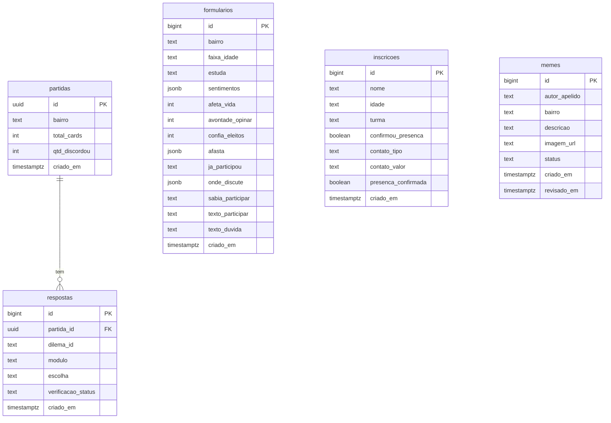

# Database — Vozes do Oziel

Banco de dados: **Supabase (PostgreSQL)**. Schema em `supabase/schema.sql`.

Acesso: somente via service role key nas rotas de API do Next.js. RLS habilitado em todas as tabelas — nenhum cliente pode acessar diretamente. O cliente Supabase é lazy-initialized em `src/lib/supabase.ts` (função `supa()`).

## Princípio de privacidade

O projeto lida com menores de 12 a 17 anos. Regras invioláveis:
- Nenhum apelido é gravado nas partidas — só bairro (grosso) e respostas.
- O dashboard público (`/api/dados`) expõe apenas agregados anônimos.
- Texto livre (`texto_participar`, `texto_duvida`) nunca sai do painel admin.
- Memes só aparecem publicamente após aprovação da equipe.

---

## Tabelas

### `partidas`

Uma linha por sessão de jogo concluída. Completamente anônima.

| Coluna | Tipo | Descrição |
|--------|------|-----------|
| `id` | uuid PK | Identificador da partida (`gen_random_uuid()`) |
| `bairro` | text | Bairro informado pelo jogador (max 40 chars) |
| `total_cards` | int | Quantidade de dilemas vistos |
| `qtd_discordou` | int | Quantidade de swipes para a esquerda (discordou) |
| `criado_em` | timestamptz | Timestamp de inserção (default: now()) |

**Índices**: `idx_partidas_bairro` em `bairro`.
**RLS**: habilitado (acesso somente via service role).

---

### `respostas`

Uma linha por card respondido por partida.

| Coluna | Tipo | Descrição |
|--------|------|-----------|
| `id` | bigint PK identity | Auto-incremento |
| `partida_id` | uuid FK → `partidas.id` | Referência à partida (cascade delete) |
| `dilema_id` | text | ID do dilema (ex: `d01`, `imp_abc`) |
| `modulo` | text | Módulo temático (`participação`, `desinformação`, etc.) |
| `escolha` | text | `right` (concordou) ou `left` (discordou) |
| `verificacao_status` | text | Status fact-check do dilema respondido |
| `criado_em` | timestamptz | Timestamp de inserção |

**Índices**: `idx_respostas_dilema` em `dilema_id`; `idx_respostas_partida` em `partida_id`.
**Constraint**: `escolha in ('right','left')`.
**RLS**: habilitado.

---

### `formularios`

Respostas da pesquisa qualitativa anônima (versão curta no fim do jogo ou completa em `/pesquisa`).

| Coluna | Tipo | Descrição |
|--------|------|-----------|
| `id` | bigint PK identity | Auto-incremento |
| `bairro` | text | Bairro (max 40) |
| `faixa_idade` | text | Faixa etária (`12–13`, `14–15`, `16–17`, `18+`) |
| `estuda` | text | Situação escolar (apenas versão completa) |
| `sentimentos` | jsonb | Array: sentimentos sobre política (marca-várias) |
| `afeta_vida` | int | Escala 1–5: "política afeta minha vida" |
| `avontade_opinar` | int | Escala 1–5: "me sinto à vontade pra opinar" (completa) |
| `confia_eleitos` | int | Escala 1–5: "dá pra confiar em eleitos" (completa) |
| `afasta` | jsonb | Array: o que afasta da participação (completa) |
| `ja_participou` | text | Frequência de participação no bairro |
| `onde_discute` | jsonb | Array: onde discute política (completa) |
| `sabia_participar` | text | Sabe que dá pra participar de decisão do bairro (completa) |
| `texto_participar` | text | Texto livre — somente admin (max 500) |
| `texto_duvida` | text | Texto livre — somente admin (max 500) |
| `criado_em` | timestamptz | Timestamp de inserção |

**RLS**: habilitado. Texto livre nunca exposto no endpoint público `/api/dados`.

---

### `inscricoes`

Inscrições para o encontro presencial. Contém dados nominais (nome, contato).

| Coluna | Tipo | Descrição |
|--------|------|-----------|
| `id` | bigint PK identity | Auto-incremento |
| `nome` | text | Nome do participante (max 200) |
| `idade` | text | Idade informada (max 10) |
| `turma` | text | Turma escolhida: manhã (9h–11h) ou tarde (14h30–16h30) |
| `confirmou_presenca` | boolean | Checkbox "tô dentro" no formulário |
| `contato_tipo` | text | Canal de confirmação: WhatsApp, SMS, Email ou null |
| `contato_valor` | text | Número/email para contato (max 200) |
| `presenca_confirmada` | boolean | Confirmação manual pela equipe (default: false) |
| `criado_em` | timestamptz | Timestamp de inserção |

**Índices**: `idx_inscricoes_turma` em `turma`.
**RLS**: habilitado (acesso somente via admin routes).

---

### `memes`

Memes enviados pela comunidade via `/enviar-meme`. Ficam em fila de moderação antes de aparecer publicamente.

| Coluna | Tipo | Descrição |
|--------|------|-----------|
| `id` | bigint PK identity | Auto-incremento |
| `autor_apelido` | text | Apelido para crédito (max 40, opcional) |
| `bairro` | text | Bairro do autor (max 40, opcional) |
| `descricao` | text | Descrição/contexto do meme (max 1000) |
| `imagem_url` | text | URL do Vercel Blob (max 600, opcional) |
| `status` | text | `pendente`, `aprovado` ou `recusado` (default: `pendente`) |
| `criado_em` | timestamptz | Timestamp de inserção |
| `revisado_em` | timestamptz | Timestamp da última moderação |

**Índices**: `idx_memes_status` em `status`.
**Constraint**: `status in ('pendente','aprovado','recusado')`.
**RLS**: habilitado.

---

## Diagrama de Relações



---

## Configuração

O cliente é inicializado em `src/lib/supabase.ts`:

```typescript
export function supa(): SupabaseClient {
  // lazy singleton — service role, sem persistência de sessão
  client = createClient(url, key, { auth: { persistSession: false } })
  return client
}
```

Variáveis de ambiente necessárias: `SUPABASE_URL` (ou `NEXT_PUBLIC_SUPABASE_URL`) e `SUPABASE_SERVICE_ROLE_KEY`.

Para aplicar o schema pela primeira vez: executar `supabase/schema.sql` no SQL Editor do painel do Supabase.
