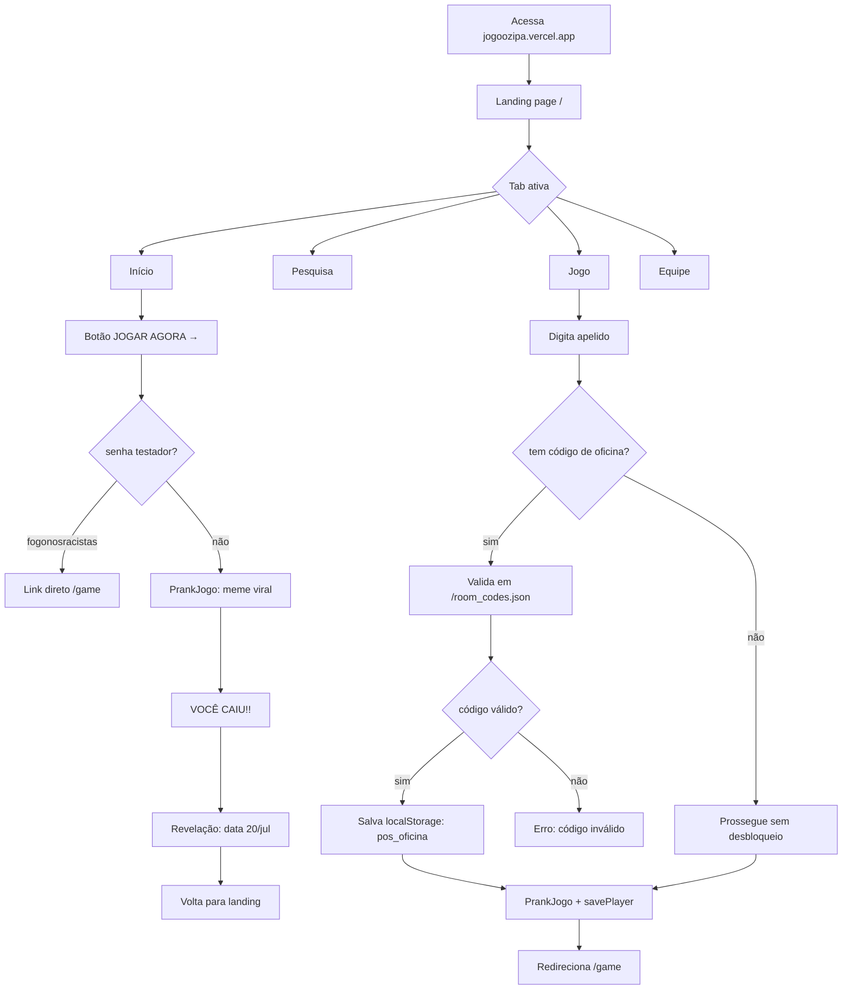
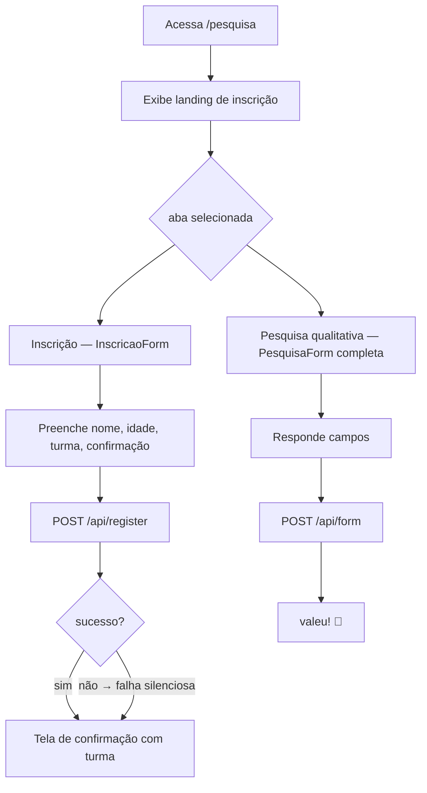
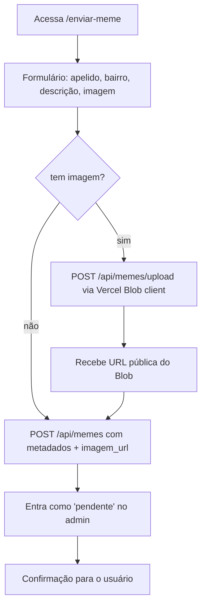
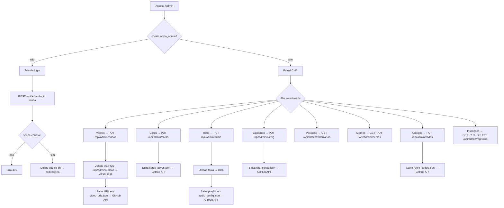
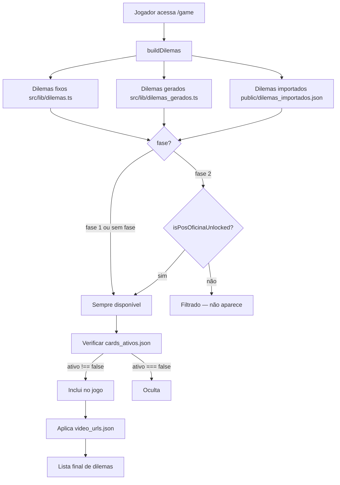

# Fluxos de Usuário — Vozes do Oziel

---

## Fluxo Principal: Landing → Jogo



---

## Fluxo do Jogo (/game)

```mermaid
graph TD
    A[/game carregado] --> B{player no localStorage?}
    B -- não --> C[router.replace /]
    B -- sim --> D[Carrega dilemas runtime]

    D --> D1[fetchImportados do dilemas_importados.json]
    D1 --> D2[Filtra por fase + cards_ativos.json]
    D2 --> D3[Carrega video_urls.json]
    D3 --> E[Fase: swipe]

    E --> F[SwipeCard exibe dilema]
    F --> G{Usuário arrasta ≥90px}
    G -- direita → concordou --> H[Vibra + playConcordo]
    G -- esquerda → discordou --> I[Vibra + playDiscordo]
    H --> J[Fase: consequence]
    I --> J

    J --> K[ConsequenceScreen]
    K --> L{dilema tem video_url?}
    L -- sim --> M[Fase: video → VideoScreen]
    L -- não --> N{último card?}
    M --> O[Usuário assiste/pula]
    O --> N

    N -- não --> P[Avança índice → Fase: swipe]
    P --> F
    N -- sim --> Q[Salva respostas fase 1 em localStorage]
    Q --> R[Fase: end → EndScreen]

    R --> S[POST /api/track bairro + results]
    R --> T[Exibe stats + mirror]
    T --> U{mudou opinião pós-oficina?}
    U -- sim --> V[Mostra comparação antes/depois]
    U --> W[FormularioFinal pesquisa rápida]
    W --> X[POST /api/form]
    R --> Y[Compartilhar WhatsApp]
    R --> Z[Jogar de novo → reinicia estado]
```

---

## Fluxo de Inscrição (/pesquisa)



---

## Fluxo de Envio de Meme (/enviar-meme)



---

## Fluxo de Moderação Admin (/admin)



---

## Sistema de Fases e Desbloqueio



---

## Módulos Temáticos e Cores

| Módulo | Cor | Hex |
|--------|-----|-----|
| participação | Verde | `#26C79A` |
| desinformação | Vermelho | `#E8402F` |
| eleição | Azul | `#3B82F6` |
| território | Amarelo | `#FFD21E` |

---

## Sistema Mirror (Fase 2)

Dilemas de fase 2 podem referenciar dilemas de fase 1 via campo `espelho_de`. Ao chegar na `EndScreen`, o sistema compara as respostas atuais com as da fase 1 (salvas em `localStorage ozipa_respostas_f1`):

- Se a escolha mudou: exibe bloco "você evoluiu" com a comparação explícita.
- Se não mudou: não mostra nada.

O objetivo é visualizar o impacto da oficina presencial na reflexão do jovem.
